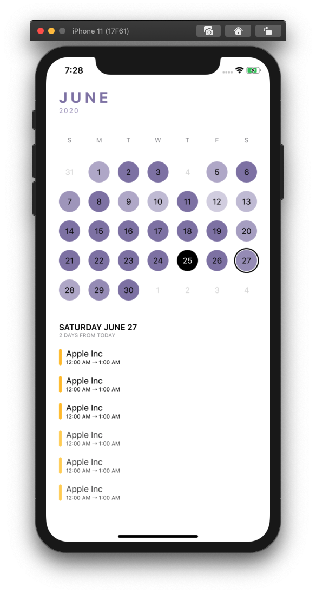
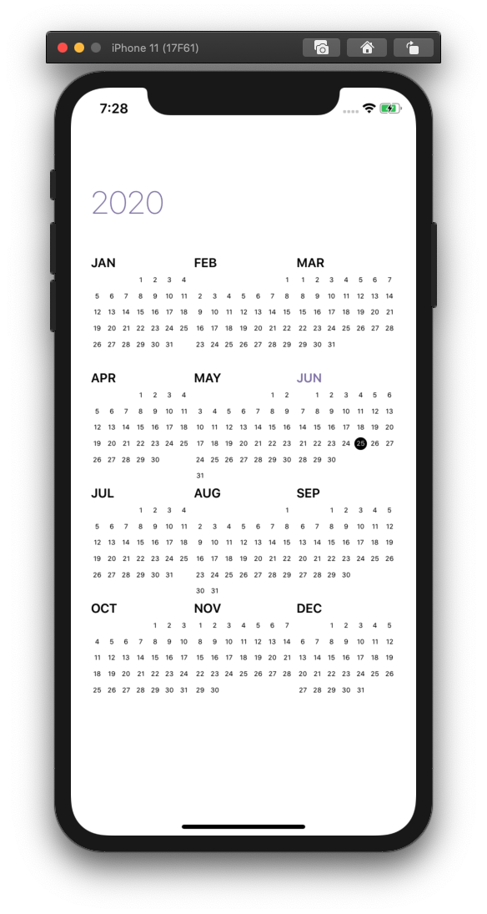

# ElegantCalendar

<p align="leading">
    
    
    <a href="https://github.com/ThasianX/Elegant-Pages/blob/master/LICENSE"></a>
</p>

ElegantCalendar is an efficient and customizable full screen calendar written in SwiftUI.

<br/>


<p>
  
  
</p>

- [Introduction](#introduction)
- [Basic Usage](#basic-usage)
- [How It Works](#how-it-works)
- [Customization](#customization)
- [Demos](#demos)
- [Installation](#installation)
- [Requirements](#requirements)
- [Contributing](#contributing)
- [Resources](#resources)
- [License](#license)

## Introduction

`ElegantCalendar` is inspired by [TimePage](https://us.moleskine.com/timepage/p0486). 

It is mainly meant to be used with apps that require the use of a calendar to function, not as a full screen date picker(may be supported in future).

Also, sadly I upgraded my iPhone to iOS14 the other day and couldn't run the app on my phone :c. So could only get screenshots for light mode :c

## Basic usage

Using `ElegantCalendar` is as easy as:

```swift

import ElegantCalendar

struct ExampleCalendarView: View {

    @ObservedObject var calendarManager = ElegantCalendarManager(
        configuration: CalendarConfiguration(startDate: startDate,
                                             endDate: endDate,
                                             themeColor: .blackPearl))

    var body: some View {
        ElegantCalendarView(calendarManager: calendarManager)
    }

}
```

## How it works

[`ElegantCalendarView`](https://github.com/ThasianX/ElegantCalendar/blob/master/Sources/ElegantCalendar/Views/ElegantCalendarView.swift) uses the [`ElegantHPages`](https://github.com/ThasianX/ElegantPages/blob/master/Sources/ElegantPages/Pages/Public/ElegantHPages.swift) view from [`ElegantPages`](https://github.com/ThasianX/ElegantPages). Essentially, it's just a swipable `HStack` that loads all the views immediately. And it's also for this reason that it is not recommended that `ElegantCalendarView` should not be used as a date picker. Here's why.

Let's first talk about the monthly calendar where you can swipe up and down to see the next/previous month. This view uses [`ElegantVList`](https://github.com/ThasianX/ElegantPages/blob/master/Sources/ElegantPages/Lists/Public/ElegantVList.swift) and is really efficient memory and performance wise. When it comes to the yearly calendar, performance is just as amazing. However, the catch is that all the year views have to be loaded into memory and drawn onto the screen first. This takes a few seconds depending on your date range, the wider the longer. However, once this loading process is over, the calendar functions smoothly and elegantly. 

So how can this be fixed? Either create a simpler yearly calendar that doesn't require as much CoreGraphics drawing as the current one or load the year views on demand. The problem with the second approach is that SwiftUI is just inefficient at making views, as it spends a [LOT of CPU on rendering](https://github.com/warrenburton/DequeueOrNot). Hopefully, in future iterations of SwiftUI, the rendering becomes smoother. As for the former approach, it seems the most feasible and I will consider implementing it if enough people display interest. Just make an issue about it so I can tell.

## Customization

The following aspects of `ElegantCalendarView` can be customized:

#### `configuration`: The configuration of the calendar view

```swift 

public struct CalendarConfiguration: Equatable {

    let calendar: Calendar
    let startDate: Date
    let endDate: Date
    let themeColor: Color

}

```

#### `initialMonth`: The initial month to display on the calendar. If not specified, automatically defaults to the first month.

#### `datasource`: The datasource of the calendar

```swift 

public protocol ElegantCalendarDataSource {

    func calendar(backgroundColorOpacityForDate date: Date) -> Double
    func calendar(canSelectDate date: Date) -> Bool
    func calendar(viewForSelectedDate date: Date, dimensions size: CGSize) -> AnyView

}

```

This allows you to customize the opacity of any given day, whether you want a day to be tappable or not, and the accessory view that shows when a day is tapped.

#### `delegate`: The delegate of the calendar

```swift 

public protocol ElegantCalendarDelegate {

    func calendar(didSelectDate date: Date)
    func calendar(willDisplayMonth date: Date)

}

```

This is just a convenience to handle the shortcomings of the `@Published` wrapper which doesn't support `didSet`. Conform to this if you need to do things when a month is displayed or date changes.

## Demos

The demo shown in the GIF can be checked out on [example repo](https://github.com/ThasianX/ElegantCalendar/tree/master/Example).

## Installation

`ElegantCalendar` is available using the [Swift Package Manager](https://swift.org/package-manager/):

Using Xcode 11, go to `File -> Swift Packages -> Add Package Dependency` and enter https://github.com/ThasianX/ElegantCalendar

If you are using `Package.swift`, you can also add `ElegantCalendar` as a dependency easily.

```swift

dependencies: [
    ...
    .package(url: "https://github.com/ThasianX/ElegantCalendar", .upToNextMajor(from: "1.0.0"))
    ...
]

```

## Requirements

- iOS 13.0+
- Xcode 11.0+

## Contributing

If you find a bug, or would like to suggest a new feature or enhancement, it'd be nice if you could [search the issue tracker](https://github.com/ThasianX/ElegantCalendar/issues) first; while we don't mind duplicates, keeping issues unique helps us save time and considates effort. If you can't find your issue, feel free to [file a new one](https://github.com/ThasianX/ElegantCalendar/issues/new).

## Resources

Also, here's a [dump of resources](resources.txt) I found useful when working on this

## License

This project is licensed under the MIT License - see the [LICENSE](LICENSE) file for details
