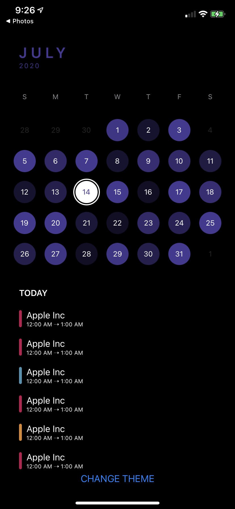
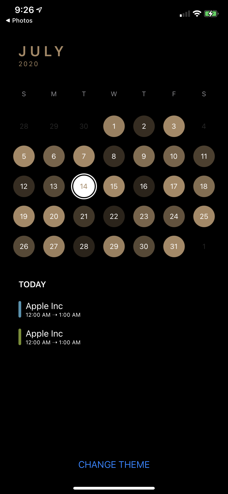
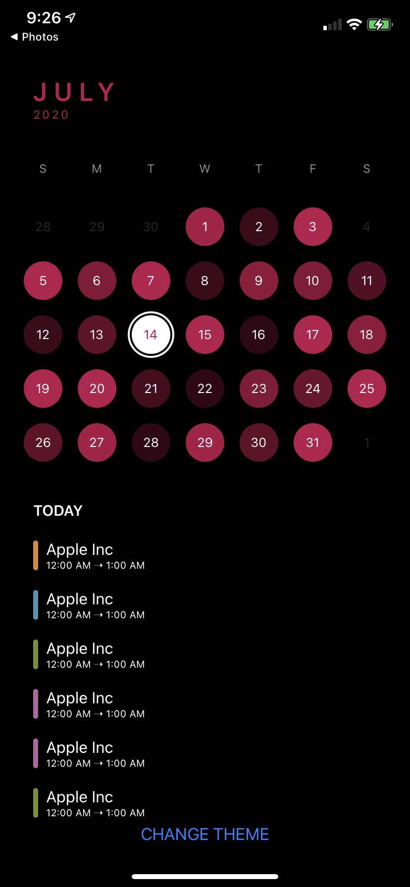
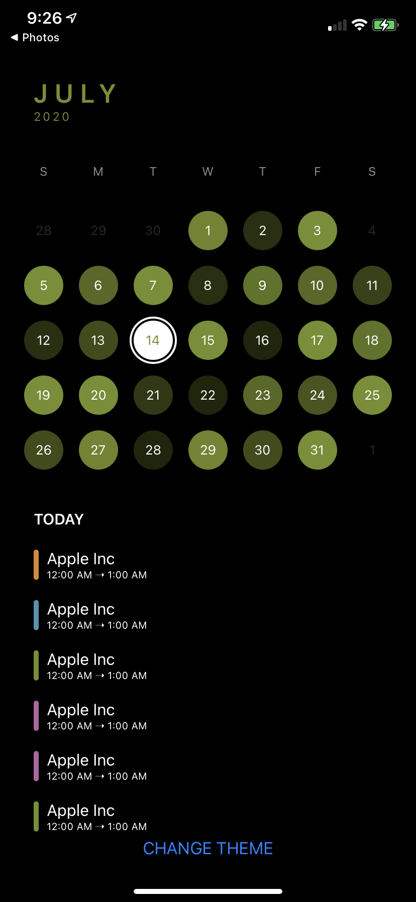
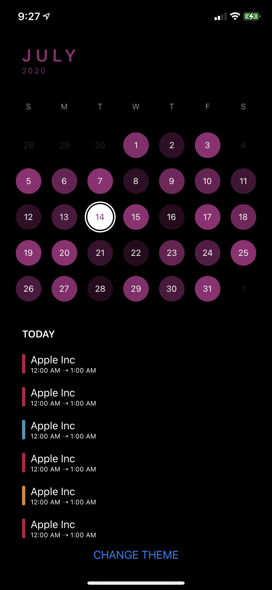
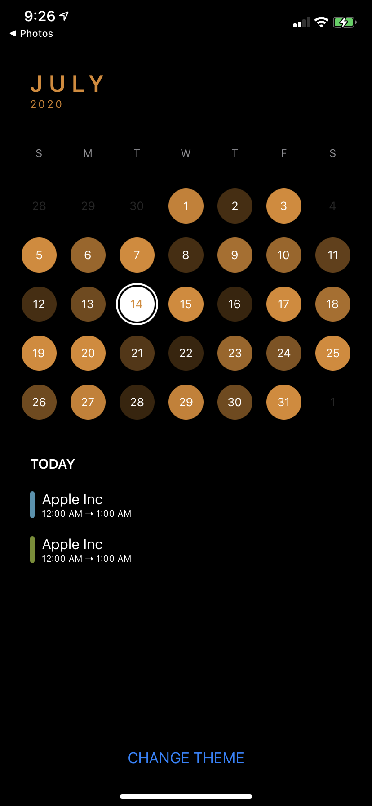
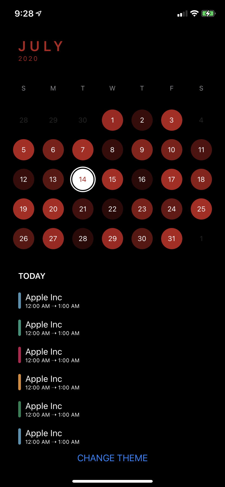
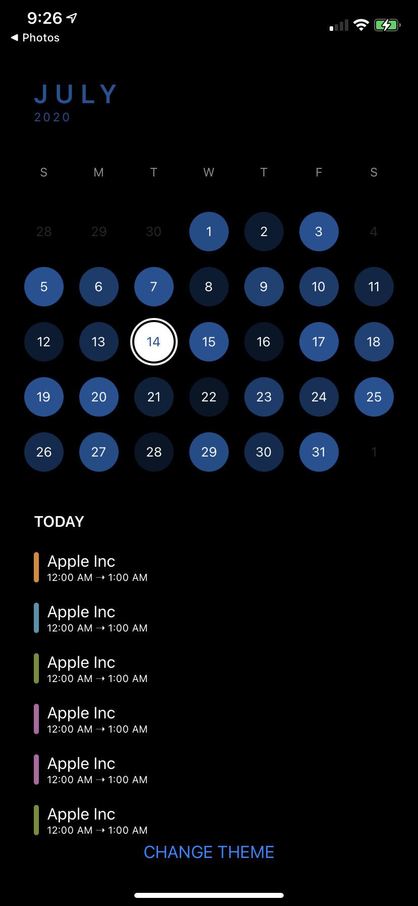

# ElegantCalendar

<p align="leading">
    
    
    <a href="https://github.com/ThasianX/Elegant-Pages/blob/master/LICENSE"></a>
</p>

ElegantCalendar is an efficient and customizable full screen calendar written in SwiftUI.

<br/>

 

## [ElegantTimeline](https://github.com/ThasianX/ElegantTimeline-SwiftUI) - Shows what's possible using ElegantCalendar


### Comes with 8 default themes. You can also configure your own theme. Read more to find out.

<p>  
     
     
     
     
     
     
     
</p>

- [Introduction](#introduction)
- [Basic Usage](#basic-usage)
- [How It Works](#how-it-works)
- [Customization](#customization)
- [Use Cases](#use-cases)
- [Demos](#demos)
- [Installation](#installation)
- [Requirements](#requirements)
- [Contributing](#contributing)
- [Resources](#resources)
- [License](#license)

## Introduction

`ElegantCalendar` is inspired by [TimePage](https://us.moleskine.com/timepage/p0486) and is part of a larger repository of elegant demonstrations like this: [TimePage Clone](https://github.com/ThasianX/TimePage-Clone). It uses [ElegantPages](https://github.com/ThasianX/ElegantPages), another library I wrote specifically for paging so check that out :)

It is mainly meant to be used with apps that require the use of a calendar to function(like [ElegantTimeline](https://github.com/ThasianX/ElegantTimeline-SwiftUI)), not as a full screen date picker(the demo demonstrates how to do so if you really want to).

Features:

* Display months and years in a full screen vertical scrolling layout
* Custom layout system that allows virtually infinite date ranges with minimal increasing memory usage
* Customization of individual day views
* Customization of the calendar color scheme, light and dark
* Customization of the accessory view displayed when selecting a day
* Excluding certain days from being selectable on the calendar
* Scrolling to a particular day, month, or year with or without animation
* Built in button that scrolls back to today’s month or year
* Flexibility in either using the full calendar view that has both the monthly and yearly view or just one of the individual views
* Haptics when performing certain actions
* Intuitive navigation between the yearly and monthly view: swipe between views or tap on the month header to navigate to the yearly view
* Elegant default themes


## Basic usage

Using `ElegantCalendar` is as easy as:

```swift

import ElegantCalendar

struct ExampleCalendarView: View {

    @ObservedObject var calendarManager = ElegantCalendarManager(
        configuration: CalendarConfiguration(startDate: startDate,
                                             endDate: endDate))

    var body: some View {
        ElegantCalendarView(calendarManager: calendarManager)
    }

}
```

However, if you just want an individual view, not the entire calendar view, you can do either:

```swift

import ElegantCalendar

struct ExampleMonthlyCalendarView: View {

    @ObservedObject var calendarManager = MonthlyCalendarManager(
        configuration: CalendarConfiguration(startDate: startDate,
                                             endDate: endDate))

    var body: some View {
        MonthlyCalendarView(calendarManager: calendarManager)
    }

}

struct ExampleYearlyCalendarView: View {

    @ObservedObject var calendarManager = YearlyCalendarManager(
        configuration: CalendarConfiguration(startDate: startDate,
                                             endDate: endDate))

    var body: some View {
        YearlyCalendarView(calendarManager: calendarManager)
    }

}

```

## How it works

[`ElegantCalendarView`](https://github.com/ThasianX/ElegantCalendar/blob/master/Sources/ElegantCalendar/Views/ElegantCalendarView.swift) uses the [`ElegantHPages`](https://github.com/ThasianX/ElegantPages/blob/master/Sources/ElegantPages/Pages/Public/ElegantHPages.swift) view from [`ElegantPages`](https://github.com/ThasianX/ElegantPages). Essentially, it's just a swipable `HStack` that loads all the views immediately. And it's also for this reason that it is not recommended that `ElegantCalendarView` should not be used as a date picker. Here's why.

Let's first talk about the monthly calendar where you can swipe up and down to see the next/previous month. This view uses [`ElegantVList`](https://github.com/ThasianX/ElegantPages/blob/master/Sources/ElegantPages/Lists/Public/ElegantVList.swift) and is really efficient memory and performance wise. When it comes to the yearly calendar, performance is just as amazing. However, the catch is that all the year views have to be loaded into memory and drawn onto the screen first. This takes a few seconds depending on your date range, the wider the longer. However, once this loading process is over, the calendar functions smoothly and elegantly. 

So how can this be fixed? Either create a simpler yearly calendar that doesn't require as much CoreGraphics drawing as the current one or load the year views on demand. The problem with the second approach is that SwiftUI is just inefficient at making views, as it spends a [LOT of CPU on rendering](https://github.com/warrenburton/DequeueOrNot). Hopefully, in future iterations of SwiftUI, the rendering becomes smoother. As for the former approach, it seems the most feasible and I will consider implementing it if enough people display interest. Just make an issue about it so I can tell.

## Customization

### `ElegantCalendarManager`

#### `configuration`: The configuration of the calendar view

```swift 

public struct CalendarConfiguration: Equatable {

    let calendar: Calendar
    let ascending: Bool // reverses the order in which the calendar is laid out
    let startDate: Date
    let endDate: Date

}

```

#### `initialMonth`: The initial month to display on the calendar. If not specified, automatically defaults to the first month.

#### `datasource`: The datasource of the calendar

```swift 

public protocol ElegantCalendarDataSource: MonthlyCalendarDataSource, YearlyCalendarDataSource { }

public protocol MonthlyCalendarDataSource {

    func calendar(backgroundColorOpacityForDate date: Date) -> Double
    func calendar(canSelectDate date: Date) -> Bool
    func calendar(viewForSelectedDate date: Date, dimensions size: CGSize) -> AnyView

}

public protocol YearlyCalendarDataSource { }

```

This allows you to customize the opacity of any given day, whether you want a day to be tappable or not, and the accessory view that shows when a day is tapped.

#### `delegate`: The delegate of the calendar

```swift 

public protocol ElegantCalendarDelegate: MonthlyCalendarDelegate, YearlyCalendarDelegate { }

public protocol MonthlyCalendarDelegate {

    func calendar(didSelectDay date: Date)
    func calendar(willDisplayMonth date: Date)

}

public protocol YearlyCalendarDelegate {

    func calendar(didSelectMonth date: Date)
    func calendar(willDisplayYear date: Date)

}

```

This is just a convenience to handle the shortcomings of the `@Published` wrapper which doesn't support `didSet`. Conform to this if you need to do things when a month is displayed or date changes.

#### `theme`: The theme of various components of the calendar. Default is royal blue. Available for `ElegantCalendarView` & `YearlyCalendarView` & `MonthlyCalendarView`.

```swift

public struct CalendarTheme: Equatable, Hashable {

    let primary: Color

}

public extension CalendarTheme {

    static let brilliantViolet = CalendarTheme(primary: .brilliantViolet)
    static let craftBrown = CalendarTheme(primary: .craftBrown)
    static let fluorescentPink = CalendarTheme(primary: .fluorescentPink)
    static let kiwiGreen = CalendarTheme(primary: .kiwiGreen)
    static let mauvePurple = CalendarTheme(primary: .mauvePurple)
    static let orangeYellow = CalendarTheme(primary: .orangeYellow)
    static let red = CalendarTheme(primary: .red)
    static let royalBlue = CalendarTheme(primary: .royalBlue)

}

ElegantCalendarView(...)
    .theme(.mauvePurple)

```

To configure your own theme, just pass in your color into the `CalendarTheme` initializer. To have dynamic appearance, make sure your `Color` has both a light and dark appearance.

#### `horizontal` or `vertical`: The orientation of the calendar. The default is `horizontal`, as shown in the GIF. Available for `ElegantCalendarView` & `YearlyCalendarView` & `MonthlyCalendarView`. 

```swift

ElegantCalendarView(...)
    .vertical()

```

#### `allowsHaptics`: Whether haptics is enabled or not. Default is enabled. Available for `ElegantCalendarView` & `MonthlyCalendarView`

```swift

ElegantCalendarView(...)
    .allowsHaptics(false)

```

Users get haptics whenever they tap a day, scroll to a new month, or press the scroll back to today button.

#### `frame`: Custom width for the monthly calendar view. Available for `MonthlyCalendarView`

```swift

MonthlyCalendarView(...)
    .frame(width: ...)

```

## Use Cases

The following aspects of `ElegantCalendarManager` can be used:

`var currentMonth: Date` - The current month displayed on the calendar view.

`var selectedDate: Date?` - The date selected on the calendar view, if any.

`var isShowingYearView: Bool` - Whether the year view is showing. If false, the month view is showing.

`func scrollToMonth(_ month: Date, animated: Bool = true)` - Scroll back to a certain month, animated or not. No date is selected in the process.

`func scrollBackToToday(animated: Bool = true)` - Scroll back to today, animated or not. Today's date is selected in the process.

`func scrollToDay(_ day: Date, animated: Bool = true)` - Scroll back to a certain date, animated or not. The date is selected in the process.

## Demos

The demos shown in the GIF can be checked out on [example repo](https://github.com/ThasianX/ElegantCalendar/tree/master/Example).

## Installation

`ElegantCalendar` is available using the [Swift Package Manager](https://swift.org/package-manager/):

Using Xcode 11, go to `File -> Swift Packages -> Add Package Dependency` and enter https://github.com/ThasianX/ElegantCalendar

If you are using `Package.swift`, you can also add `ElegantCalendar` as a dependency easily.

```swift

let package = Package(
  name: "TestProject",
  dependencies: [
    .package(url: "https://github.com/ThasianX/ElegantCalendar", from: "4.2.0")
  ],
  targets: [
    .target(name: "TestProject", dependencies: ["ElegantCalendar"])
  ]
)

```

Inside whatever app is using `ElegantCalendar` or your `Swift Package` that uses `ElegantCalendar` as a dependency:

1) Scroll the project navigator down to the `Swift Package Dependencies` section. Inside `ElegantCalendar`, you'll see a directory called `ElegantCalendar.xcassets`. 
2) After you've located it, open your project's settings and navigate to your target's build phases in a parallel window. 
3) Drag `ElegantCalendar.xcassets` into your target's `Copy Bundle Resources`. Make sure that `Copy items if needed` is unticked and `Create groups` is ticked. This step is crucial because `ElegantCalendar` uses custom icons, which `SPM` will support in [Swift 5.3](https://github.com/apple/swift-evolution/blob/master/proposals/0271-package-manager-resources.md).
4) This last step is for making sure that when others clone your repository, the assets will be available to them as well. Click the `ElegantCalendar.xcassets` that has appeared in your project navigator and in the inspector on the right, select `Identity and Type`. Inside, make sure that `Location` is set to `Relative to Build Products`.

If you don't know how to do this, refer to the `Demo`.

## Requirements

- iOS 13.0+
- Xcode 11.0+

## Contributing

If you find a bug, or would like to suggest a new feature or enhancement, it'd be nice if you could [search the issue tracker](https://github.com/ThasianX/ElegantCalendar/issues) first; while we don't mind duplicates, keeping issues unique helps us save time and considates effort. If you can't find your issue, feel free to [file a new one](https://github.com/ThasianX/ElegantCalendar/issues/new).

## Resources

Also, here's a [dump of resources](resources.txt) I found useful when working on this

## License

This project is licensed under the MIT License - see the [LICENSE](LICENSE) file for details
